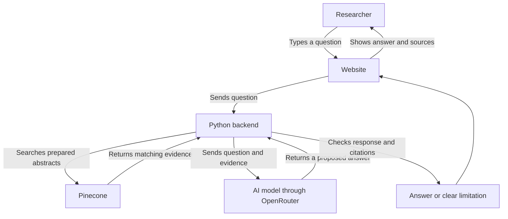
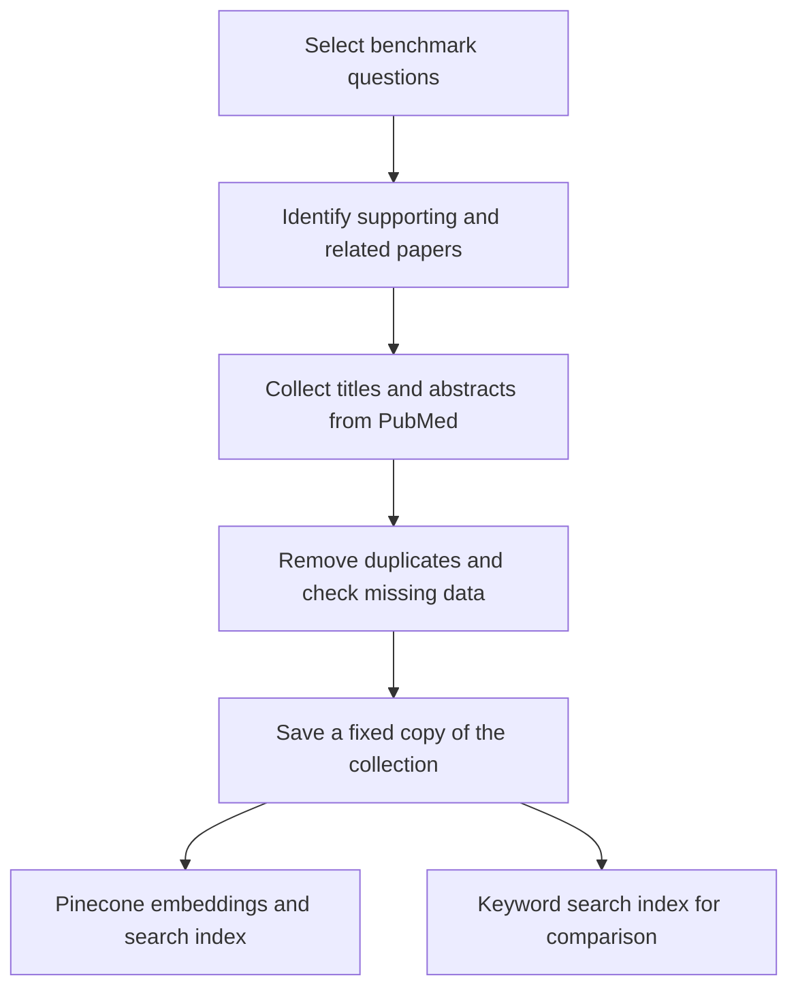
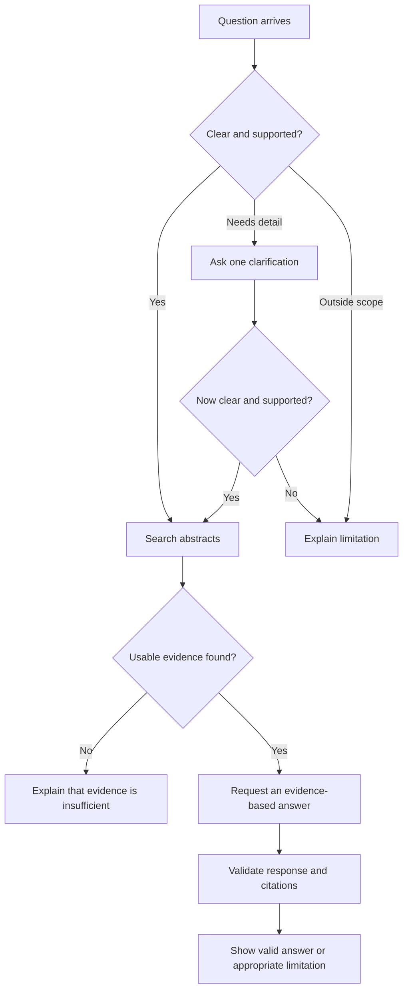
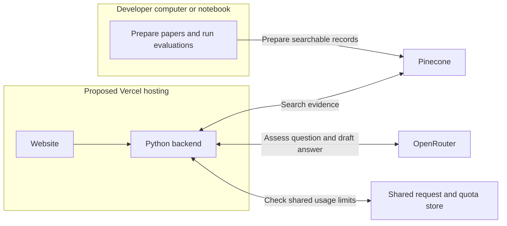

# Biomedical Literature Assistant — Architecture Explained

## 1. The idea in one sentence

**A researcher asks a question, the app finds relevant research abstracts, and an AI writes a short answer with links to the evidence.**

An abstract is the short summary published with a research paper. Our first version searches a prepared collection of titles and abstracts.

This guide explains the planned system. The [technical PRD](TECHNICAL_PRD.md) contains the detailed rules; the [implementation plan](IMPLEMENTATION_PLAN.md) gives the build order.

## 2. The main parts

Think of the app as a research desk with a searchable collection behind it.

| Part | In simple terms | Planned technology |
|---|---|---|
| Website | Where the researcher types a question and reads the answer | Next.js + TypeScript |
| Backend | The coordinator: checks the question, searches, requests an answer, and checks the response | Python + FastAPI |
| Searchable collection | Finds abstracts that are similar in meaning to the question | Pinecone vector database |
| Embedding model | Turns text into a list of numbers used for meaning-based search | Pinecone-hosted llama-text-embed-v2 |
| Answer model | Reads the selected evidence and drafts an answer | A free model accessed through OpenRouter |

**Pinecone finds evidence. The answer model writes from that evidence.** These are separate jobs.

This is the main successful path. The backend also handles unclear questions, missing evidence, and service failures.

## 3. Before anyone asks a question: prepare the papers

We prepare the collection ahead of time. A visitor does not trigger a new download of papers.

1. **Choose the questions used for testing.** BioASQ provides biomedical questions with reference answers and relevant papers.
2. **Collect the literature.** Include supporting abstracts and other papers on related topics, so the search must distinguish useful results from less useful ones.
3. **Clean and save it.** Preserve each paper's title, abstract, identifier, and source link. Keep a fixed copy so experiments are repeatable.
4. **Make it searchable.** Prepare meaning-based search in Pinecone and a keyword-search baseline for comparison.

These preparation tasks run on the developer's computer or a notebook environment.

**The answer keys stay outside the searchable collection.** The app searches research text; it must not retrieve benchmark answers.

### What does one search result contain?

Start with a paper's title and complete abstract as one searchable item. If an abstract exceeds the embedding model's input limit, split it into smaller sections while preserving the paper link. We can settle exact sizing during implementation.

## 4. When a researcher asks a question

### Step 1 — Read the question

The website sends the question to the backend. The backend checks whether it is a supported fact or list question and whether it is clear enough to search.

- **Clear and supported:** continue.
- **Ambiguous:** ask one clarification question.
- **Outside scope or still unclear:** explain the limitation.

The initial app handles one question at a time, with at most one clarification step.

### Step 2 — Find relevant abstracts

The search system represents the question using the same embedding model used for the papers, then looks for matching records in Pinecone.

An **embedding** is a numerical representation of text. It helps search find related meaning even when wording differs. A high search score does not prove that a paper answers the question or that a medical claim is correct.

### Step 3 — Draft an answer from the evidence

The backend sends the question and selected evidence to the answer model through OpenRouter.

The model is instructed to return:

1. A direct answer, such as a name or list.
2. A brief explanation with citations.
3. An insufficient-evidence response when the selected abstracts do not support an answer.

### Step 4 — Check the response

The backend checks that the response follows the required format, that cited sources belong to the retrieved evidence, and that quoted excerpts match the source text.

**These checks catch invalid references; they do not prove scientific correctness.** Whether an answer is supported is also part of evaluation.

### Step 5 — Show the answer and sources

The researcher sees the answer, explanation, and sources they can inspect. They can open the evidence to check what the abstract actually says.

If a provider is unavailable or a free allowance is exhausted, show a temporary service message. Do not present an outage as a research finding or silently switch to a paid model.

## 5. How we test whether it works

We test **finding papers** and **answering questions** separately. Otherwise, a wrong answer would not tell us which part failed.

| Test | Plain-language question it answers |
|---|---|
| Retrieval test | Did the search find the papers identified as relevant in the benchmark? |
| Answer test | Did the app produce the expected fact or list? |
| Evidence review | Do the cited abstracts actually support the statements? |
| Failure-handling test | Does the app respond appropriately when a question is unclear, evidence is missing, or a service fails? |

The planned benchmark has **100 eligible BioASQ questions**:

- **50 development questions:** use these while improving the system.
- **50 held-out questions:** keep these aside for the final evaluation after settings are fixed.

Compare keyword search with vector search on the same collection. Evaluation uses the same Python search and answering logic as the website.

The collection deliberately contains supporting papers. Results therefore describe performance within this prepared collection, not across all of PubMed.

## 6. Where everything runs

The starting proposal is two Vercel projects: one for the website and one for the Python backend. We will verify that arrangement during feasibility work.

A small shared store tracks usage limits and duplicate requests across backend instances. Its provider is still to be selected. It is separate from Pinecone, which stores searchable evidence.

Provider keys stay in the backend. The initial product has no user accounts or saved conversation history.

## 7. Build order

1. **Check feasibility:** confirm dataset access, hosting compatibility, and free provider allowances.
2. **Prepare evidence:** collect and freeze the abstract collection and benchmark split.
3. **Build and compare search:** verify that relevant evidence can be found.
4. **Add answers and the website:** connect the shared backend, citations, and failure handling.
5. **Run final evaluation:** freeze settings, test held-out questions, and report results and limitations.

The exact free answer model, collection size, search settings, and shared-store provider are implementation decisions. The architecture gives each of them a clear place without pretending they have already been verified.
