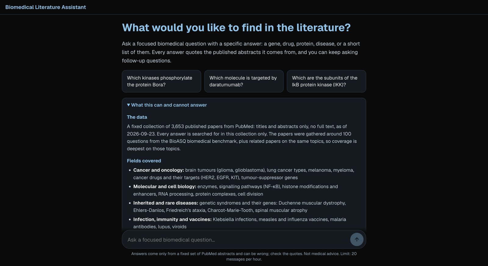
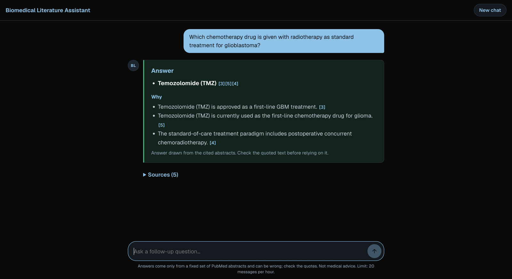
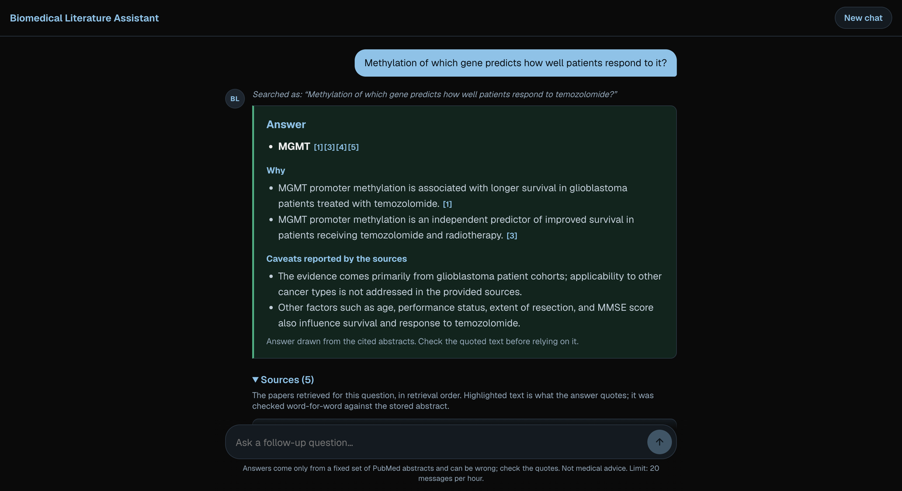
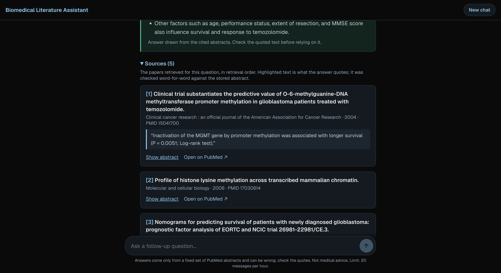
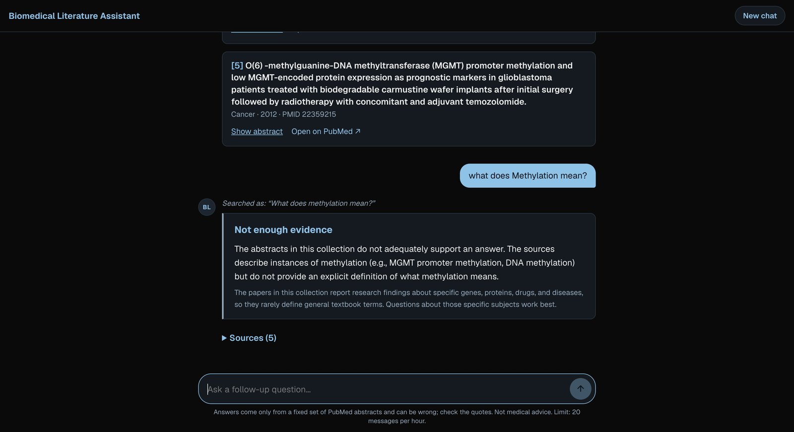

# Biomedical Literature Assistant

A question-answering assistant for focused biomedical questions. It answers from
a fixed collection of published PubMed titles and abstracts, using a pinned free
language model, and shows the exact quoted sentences behind every claim. A
question goes through assessment (in scope, out of scope, or missing a detail),
retrieval, generation, and a citation check that locates every quote verbatim in
its source before anything is displayed. When the collection does not support
an answer, the assistant says so instead of answering from the model's memory.
A separate evaluator scores the frozen system on held-out BioASQ questions.

**Implementation status:** complete. All six milestones are done and the
held-out evaluation was run once, on 2026-09-24. All hard gates held and 9 of 10
quality targets were met. The missed target: 6 of 104 claims (5.8%) said more
than their quotes, against a limit of 5%. See the [final evaluation](docs/final-evaluation.md).

**Live demo:** https://bla-frontend-gilt.vercel.app (20 questions per visitor per hour)

## Setup

Prerequisites: Python 3.12, [uv](https://docs.astral.sh/uv/), Node.js 20.9+, and
npm. Accounts: OpenRouter (free models only), Pinecone (free Starter; vector
retrieval only), and optionally Upstash Redis (shared request limits for a
public deployment). Run from the repository root:

```sh
uv sync --project backend --extra dev
npm --prefix frontend ci
```

Copy `backend/.env.example` to `backend/.env` and fill in:

```sh
OPENROUTER_API_KEY=sk-or-v1-...
PINECONE_API_KEY=pcsk_...
CLARIFICATION_SECRET=...      # python -c "import secrets; print(secrets.token_urlsafe(32))"
CORPUS_PATH=corpus/bioasq14b-v1.papers.jsonl
CORPUS_VERSION=bioasq14b-v1
ALLOW_UNMETERED_GENERATION=true   # local development only
```

Copy `frontend/.env.local.example` to `frontend/.env.local`. Keys stay in the
backend; the frontend holds only the backend URL.

The model is pinned in `backend/bla/llm.py`: `nvidia/nemotron-3-super-120b-a12b:free`.
Paid models, the random free router, and provider fallbacks are never used. The
project's OpenRouter key has a $0 credit limit, so it cannot spend money. Answer
generation is **off by default**: it runs only with shared request limits
configured, or locally with `ALLOW_UNMETERED_GENERATION=true`.

The collection file (`CORPUS_PATH`) is not in the repository. It is rebuilt from
BioASQ and PubMed; see [Reproducing the evaluation](#reproducing-the-evaluation).

## Reading results

Every question ends in exactly one outcome, defined in `backend/bla/contracts.py`
and used by the API, the web page, and the evaluator:

| Outcome | Meaning | HTTP |
|---|---|---|
| `answered` | A cited answer whose every quote was found verbatim in its source | `200` |
| `needs_clarification` | One material detail is missing; the page asks one question, once | `200` |
| `insufficient_evidence` | The collection does not support an answer; nothing comes from model memory | `200` |
| `unsupported_request` | Out of scope: personal medical advice, not biomedical, yes/no or summary questions | `200` |
| `service_unavailable` | The free provider failed, timed out, or an answer failed validation on every attempt | `503` / `504` |

A request over the visitor or daily limit gets `429`, a repeated submission key
used for a different question gets `409`, and invalid input gets `400`/`422`.
Every response carries a plain-language `message`. Provider errors, prompts, and
model output never reach the response body.

An answer shows the answer items with numbered citations, a short explanation
where each claim cites its sources, any caveats the sources report, and the
sources themselves: title, journal, year, PMID, PubMed notices (corrected or
expression of concern), the quoted sentences, and the full abstract with those
sentences highlighted. **Passing the citation check means every quote is
genuine, not that every claim is correct.** In the held-out evaluation, about
1 claim in 17 overstated its quote, so the quote is always shown for checking.

## Local web UI

```sh
# Backend: http://localhost:8010
cd backend && uv run uvicorn app:app --port 8010

# Frontend: http://localhost:3000 (second shell)
cd frontend && npm run dev
```

Open [the local app](http://localhost:3000). The page gives the question box,
the collection's scope and limits, example questions, the pending state, the
one-step clarification, the answer, and the source panels. It works as a chat:
messages stack in a conversation, the message box stays at the bottom (Enter
sends, Shift+Enter adds a line), every message after an answer is a follow-up,
a failed reply has **Try again**, and **New chat** starts over. It works with a keyboard
(the abstract and source toggles are buttons) and on phones. A
refresh starts a new chat; there is no saved history, by design.

## Screenshots

The chat opens with example questions and a description of the collection: its data, the fields it covers, and what it answers. The message box stays at the bottom.



An answer lists its items with numbered citations and a short explanation, each claim quoting its source.



A follow-up can refer to the earlier answer. Here "it" is rewritten as temozolomide, and the page shows the question it actually searched. Caveats the sources report follow the explanation.



The sources sit under each answer, in retrieval order, with the quoted sentences checked word for word against each stored abstract.



When the papers do not support an answer, the assistant says so instead of answering from the model's memory. None of the 3,653 papers defines "methylation", so it does not define it either.



## How it works

**Collection.** 3,653 PubMed records: every reference paper for 100 BioASQ
questions plus the top 3 PubMed "similar articles" of each. The similar
articles are chosen by paper ID only, never by question text or answers. The
collection is frozen with SHA-256 fingerprints; retracted records are excluded.
One searchable unit per paper, except 15 overlong papers, which are split into
sentence-bounded passages instead of being silently truncated.

**Retrieval.** BM25 (in process, 3 ms) and Pinecone vector search
(`llama-text-embed-v2`, 1024 dimensions, about 180 ms) over the same units. The
two methods tied in development, so the demo uses BM25 and both remain
evaluated. A pre-registered hybrid was tested and not adopted.

**Answering.** Two provider calls: an assessment and a generation from at most
5 sources, labelled S1–S5. The source text is marked as data, and instructions
inside it are ignored (tested with a planted instruction). Every quote must
appear verbatim in its cited source; the server computes offsets and builds
URLs from stored PMIDs. An invalid answer is retried with feedback and is never
shown in part.

**Follow-ups.** Each answer returns a signed token holding the last ten
questions and their answer items. A follow-up sends the token back; the assessment call then
rewrites the follow-up into a standalone question ("What does the
phosphorylation by the first of those kinases do?" becomes "What does the
phosphorylation of Bora by Cdk1 do?") and classifies it. Retrieval,
generation, and the citation check run on that question unchanged, and the
page shows it. Each token adds its exchange and drops the oldest, and nothing
is stored on the server. Follow-ups were added after the held-out evaluation and have not
been evaluated; the single-question prompts are still the frozen final-v1
ones, which a test checks by hash.

**Limits.** At most 4 provider attempts and 2 retries per question, 45s per
attempt, and a 90s deadline. On the public demo, Upstash Redis holds shared
counters: 20 questions per visitor per hour (a salted, daily-rotating hash of
the network address; no accounts or stored IP addresses), a site-wide cap of 300
provider attempts per day (below the 1,000 free), counted before each dispatch,
and request keys so a double click is answered once. If the store is
unreachable, generation fails closed.

**Separation.** Evaluation code lives in `bla/benchmark`, which the application
never imports (enforced by a test). Reference answers, split labels, and the
BioASQ download stay in the git-ignored `data/`. Tracked manifests hold only
IDs, counts, and hashes.

## Evaluation results

Held-out test: 50 BioASQ questions (25 fact, 25 list), run once under the frozen
[`final-v1`](evaluation/configs/final-v1.json) config, which was committed before the run:

| | Target | Result |
|---|---|---|
| Hard gates (complete accounting, real citations, exact excerpts, no key leakage) | all | ✅ all |
| Answered | ≥ 70% | ✅ 88% |
| Fact strict accuracy (all attempted) | ≥ 0.35 | ✅ 0.40 |
| List F1 (all attempted) | ≥ 0.25 | ✅ 0.53 |
| Retrieval Recall@10, BM25 / vector | ≥ 0.55 | ✅ 0.703 / 0.665 |
| Claims supported by their quotes | ≥ 85% | ✅ 85.6% |
| Claims unsupported | ≤ 5% | ❌ 5.8% |
| Median latency | ≤ 45s | ✅ 20.9s |

These results describe a research prototype on a controlled collection. They do
not establish clinical usefulness, and the claim review was done by an AI
reviewer, not a domain expert. Details, limitations, and development-versus-test
comparisons are in the [final evaluation](docs/final-evaluation.md).

## Verification

```sh
cd backend  && uv run pytest -q && uv run ruff check . ../scripts
cd frontend && npx tsc --noEmit && npx eslint . && npm run build
```

The 208 backend tests use scripted models and an in-memory Redis stand-in, and
never call a provider. Live evidence (real accounts, a real browser, a deployed
site) is recorded separately in the [feasibility report](docs/feasibility-report.md)
and the [web demo report](docs/web-demo.md).

## Reproducing the evaluation

Needs a BioASQ registration (`training14b.json` in `data/bioasq/`) and the keys
above. Every step reuses saved responses, so a rebuild reproduces the frozen
snapshot:

```sh
cd backend
uv run python ../scripts/benchmark/build_benchmark.py ../data/bioasq/training14b.json   # questions, split, collection
uv run --env-file .env python ../scripts/indexing/build_index.py bioasq14b-v1              # Pinecone index
uv run --env-file .env python ../scripts/evaluation/run_retrieval.py                      # development retrieval
uv run --env-file .env python ../scripts/evaluation/run_fixtures.py                       # controlled outcomes
uv run --env-file .env python ../scripts/evaluation/run_answers.py --fresh                # development answers
uv run python ../scripts/evaluation/check_gates.py <run_id>                               # hard gates
```

The held-out split runs only with `--split test --final ../evaluation/configs/final-v1.json`,
from a clean tree, with matching settings, and only once. A result already
exists, so the runners refuse to run it again. Evaluation runs keep a daily
request ledger sized from the account's reported free allowance, and cache
completions so re-scoring spends nothing.

## Documents

| Document | What it covers |
|---|---|
| [`PRD.md`](PRD.md) | Product requirements, user stories, scope |
| [`TECHNICAL_PRD.md`](TECHNICAL_PRD.md) | Architecture, contracts, limits, evaluation protocol |
| [`IMPLEMENTATION_PLAN.md`](IMPLEMENTATION_PLAN.md) | Milestones and completion gates |
| [`ARCHITECTURE.md`](ARCHITECTURE.md) | Plain-language walkthrough with diagrams |
| [`docs/feasibility-report.md`](docs/feasibility-report.md) | Service verification and measured provider limits |
| [`docs/data-protocol.md`](docs/data-protocol.md) | Benchmark selection, split, and collection |
| [`docs/retrieval-development.md`](docs/retrieval-development.md) | BM25 vs vector, and the hybrid experiment |
| [`docs/answering-development.md`](docs/answering-development.md) | Answer workflow, prompts, model comparison, claim review |
| [`docs/web-demo.md`](docs/web-demo.md) | The deployed demo, request limits, browser checks |
| [`docs/final-evaluation.md`](docs/final-evaluation.md) | **Held-out results, targets, and limitations** |

## Layout

```text
backend/              FastAPI service (Vercel entrypoint: app.py); package bla/
frontend/             Next.js question page
scripts/benchmark/    Benchmark and collection builder
scripts/indexing/     Pinecone loader (resumable, rate-paced)
scripts/evaluation/   Retrieval, answer, fixture, and gate runners
scripts/feasibility/  Service probes
evaluation/configs/   Frozen and registered configurations
evaluation/results/   Tracked aggregate results (no answers or question text)
evaluation/fixtures/  Invented-paper outcome cases
docs/                 Reports
```

Not included: full-text articles, open PubMed search, user accounts or saved
history, streaming answers, and any clinical validation.
